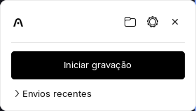
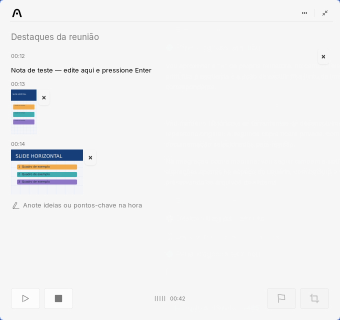

# Plaud Linux for Omarchy

Plaud Linux is an independent desktop client for Omarchy / Arch Linux on
Hyprland and Wayland. It records system audio and microphone input, keeps
timestamped notes and screenshots, and uploads to your Plaud account through
the observed desktop flow. It does not require a separate developer API
subscription. This is a **private review copy**, not an official Plaud or
Omarchy application.

- [Install, update or remove](docs/INSTALL.md)
- [Contribute and run checks](CONTRIBUTING.md)
- [Security and private reporting](SECURITY.md)
- [Third-party material and redistribution limits](THIRD_PARTY_NOTICES.md)

## Independent community project

This project exists to help Plaud users on Arch Linux and Omarchy with their
own desktop workflow. It is not intended to copy or compete with Plaud's
commercial products, replace its service, or imply an official partnership.
Plaud names and marks belong to their respective owners. This application is
not affiliated with, endorsed by, or approved by Plaud or Omarchy.

**Prefer the official Plaud application whenever it supports your system.**
Follow Plaud's official updates and recommendations. If Plaud releases an
official application compatible with Arch Linux / Omarchy, we recommend
installing that application instead of this community client. Compatibility
with future Plaud service changes is not guaranteed.

If this project is approved for listing in the Omarchy community marketplace,
the maintainer intends to contact Plaud, present the work and offer to
collaborate. Neither marketplace approval nor that contact has happened yet;
marketplace listing would not constitute Plaud approval or endorsement.

This statement of intent does not grant permission to redistribute
Plaud-derived artwork. The unresolved rights described in
[third-party notices](THIRD_PARTY_NOTICES.md) remain a public-distribution
prerequisite.

## Install

Install the Arch packages in the [installation guide](docs/INSTALL.md), then
run from an authorized source checkout as your regular desktop user:

```bash
./install.sh --autostart --hypr-shortcuts
plaud-linux --login
plaud-linux
```

Both installer options are optional. The first starts the resident client in
the background at login; the second adds global Hyprland shortcuts. Opening the
app or tray does **not** begin recording. The installed launcher continues to
use this checkout, so keep it at the same path. A standalone wheel is not the
supported installation method.

```bash
plaud-linux --login       # connect your Plaud account
plaud-linux               # open the standby card
plaud-linux --background  # keep the resident tray client
plaud-linux --status      # show local login status
```

## Record and annotate



Opening the client shows its compact standby card. Recording starts only after
an explicit action.



*Highlights panel in a local demonstration. The note and slides are synthetic;
no account or recording content is shown. [Image details](docs/images/README.md).*

1. Open the tray or launcher and click **Iniciar gravação**. A visible recording
   control remains on screen. Choose microphone and system audio separately in
   **Preferências** before a session; the live controls can change them while
   recording.
2. Use the pencil to add timestamped notes, mark the preceding 40 seconds of
   audio for analysis, or capture a screen region. Enter finishes an edit and
   returns to the next-note field; Shift+Enter inserts a line break. Screenshots
   show compact previews beside their remove buttons; the original image files
   retain their resolution. Removing a highlight does not remove its local
   media. The panel can be resized and closed without ending the recording.
3. Region selection freezes the displayed frame with `hyprpicker` while audio
   continues. Escape cancels. If the freezer is unavailable, the app warns and
   selects from the live screen; a freezer failure after startup cancels the
   capture. On Hyprland, Super + left-drag moves the recording pill between
   monitors. Its placement resets for each recording.
4. Stop the recording to upload it. Audio remains on disk if upload, annotation
   or generation fails. The native upload card then offers automatic generation
   or the custom picker. Automatic generation uses your Plaud account. Custom
   generation opens the official Plaud Web picker in an app window when WebKit
   is installed, with a browser fallback. Generated notes are viewed in Plaud
   Web. The completion notice offers **Ver as notas** and **Agora não**.

Recent uploads start collapsed in the standby card; expand **Envios recentes**
to browse them. The tray menu offers local recordings and retry for failed
uploads. Disabling cloud sync keeps recordings local until you choose to send
them. The optional Omarchy bar widget is only a launcher; the native tray
already provides access to the app. Preserve the system microphone indicator.

| Shortcut | Action |
|---|---|
| Super + Alt + R | Start or stop recording |
| Super + Alt + E | Stop recording |
| Super + Alt + P | Pause or resume |
| Alt + Shift + H | Open highlights |
| Alt + Shift + C | Select a screenshot region |

Shortcuts require `--hypr-shortcuts` and a running client.

## Preferences

Open the gear on the standby card or **Preferências** from the tray. Escape or
its close button closes only preferences. Microphone discovery runs in the
background; use **Atualizar microfones** after reconnecting a device or a discovery
failure. A missing saved microphone is shown as unavailable, without silently
choosing another input. Preferences apply to the next recording.

## Data and limits

Recordings, notes, account state and logs live under
`~/.local/share/plaud-linux/` by default. `PLAUD_LINUX_HOME` selects a different
data root; otherwise `XDG_DATA_HOME` is honored. Launcher logs follow that same
root. The installer and Preferences refuse unsafe or unrecognized integration
files rather than replacing them. Housekeeping is limited to eligible logs and
old screenshot derivatives; it does not prune recorded audio.

Login state is stored with private file permissions, but machine-derived
encryption does not protect it from another process running as the same user.
See [SECURITY.md](SECURITY.md) for the trust boundary. The included Plaud-derived
artwork has unresolved redistribution rights; see
[THIRD_PARTY_NOTICES.md](THIRD_PARTY_NOTICES.md).

The application does not implement automatic meeting detection or every
official preference. Viewing and organizing generated notes uses Plaud Web.
Generation monitoring ends when the app exits or after 30 minutes; this does
not cancel the cloud task. An invalid Plaud user login requires reconnecting
in **Preferências**; recorded audio remains available for retry.

## Verify

With an awake graphical session:

```bash
dbus-run-session -- python3 tests/run.py
```

The private review test runner expects **477 checks across 44 files**. Tests
use isolated data and block network calls. They do not prove a real account
upload, current service compatibility or physical pointer behavior. See
[tests/README.md](tests/README.md) for the test conditions.
